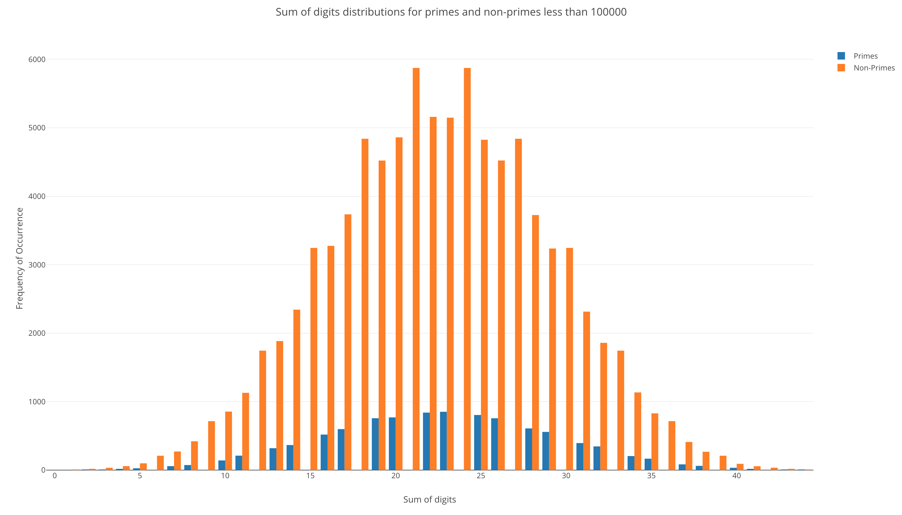
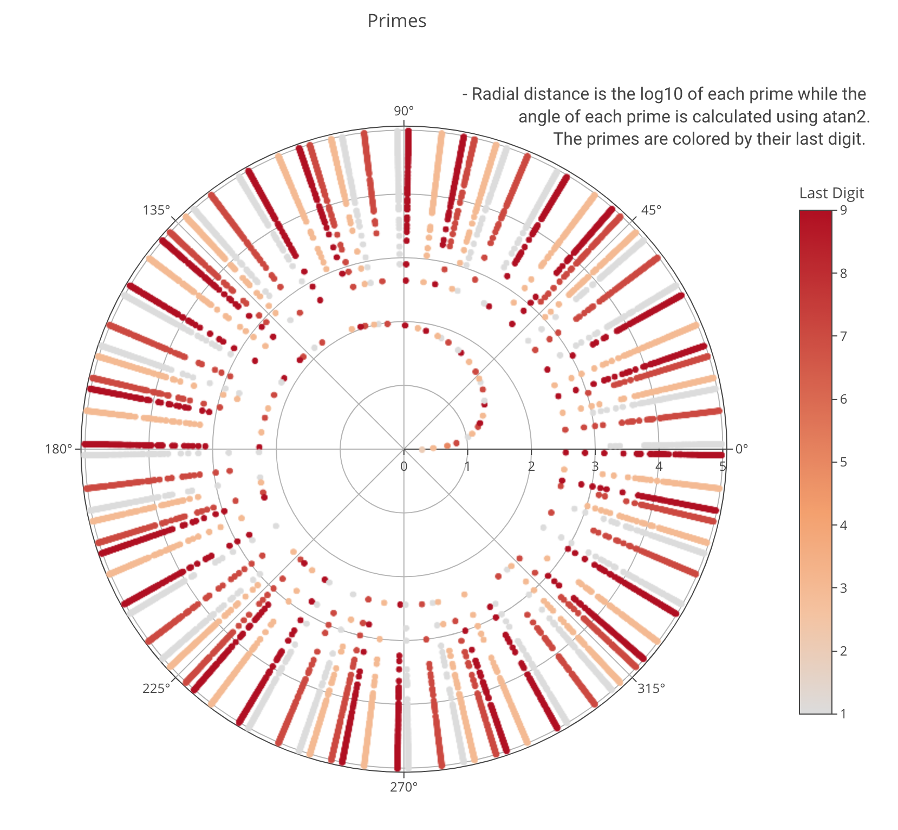

# primes

This is a Go program for looking at radial prime distributions and other things. There are various outputs produced which catalogue primes. Most of the output centers around the radial distribution of primes when they are used as degrees. Grouping primes by their last digit produces some interesting patters as well. Plots were produced manually using Plotly.

## Curiosities and Observations

**Twin Primes**

Twin primes are primes which are separated by 2. Oddly enough, there are no twin primes where the second, larger prime ends in 7 (other than 7). This is because there are no primes which end in 5 (other than 5), simply due to the fact that any number that ends in 5 is divisible by 5 and thus not prime.

This means that the second of the twin primes above 7 can only end in 1, 3 and 9. Which limits the last digit possibilities to (1,3), (7, 9) and (9, 1).

**Sum of Primes**

Primes are also limited by their sums. Due to the consequence that all numbers divisible by 3 have a sum that is also divisible by three, means that the sum of the digits in a prime will never be divisible by three either.



**Prime Azimuths**

This is kind of strange. When primes are plotted in cartesian coordinates, their azimuths are limited to a small set of possible angles. This set of angles differ depending on the last digit of the prime. When the primes are grouped by their last digit (1, 3, 7, or 9), each group has 24 azimuths. This means that when plotted in this manner, primes that end with 1 will only be along one of the 24 possibilities. The same is true for all primes of each group.

The one exception is the number 3. If included with all the other primes that end with 3, there would be 25 azimuths. However, the number three itself is the only prime with that angle so it's not really a pattern. It's an exception to the rule.

```go

// Assume prime is a degree and convert to radians
primeRad := float64(prime) / 180 * math.Pi

// Get X,Y coordinates
primeX := math.Cos(primeRad)
primeY := math.Sin(primeRad)

// Get theta from x,y and convert to degrees
primeAzm := math.atan2(primeY, primeX)  * 180 / math.Pi
if primeAzm < 0 {
    primeAzm += 360
}

```

Another way to get the same answer is to mod the prime by 360 degrees.


